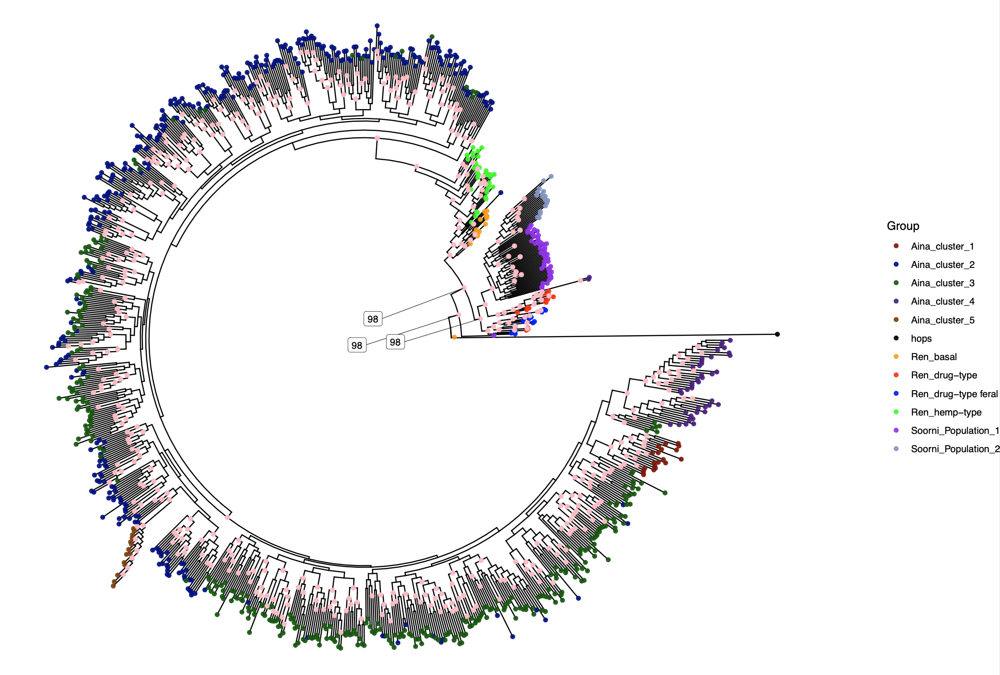

This repository provides the supporting data for a recently submitted manuscript entitled "Ancestry and Environmental Adaptation in North American Feral Cannabis"

A pre-print of this work can be found at: X

High resolution verions of main and supplemental figures will be available on fig share https://figshare.com/authors/Anna_H_McCormick/17741367

